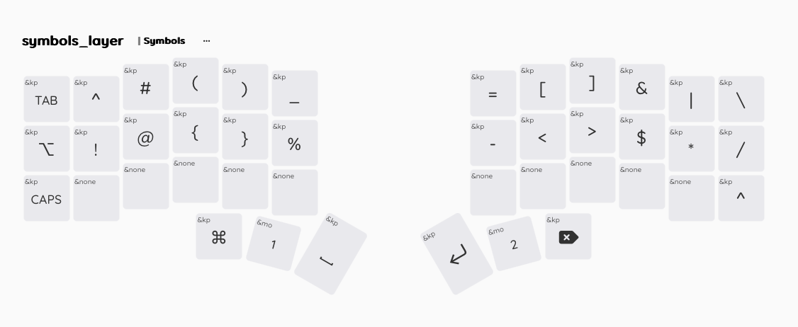
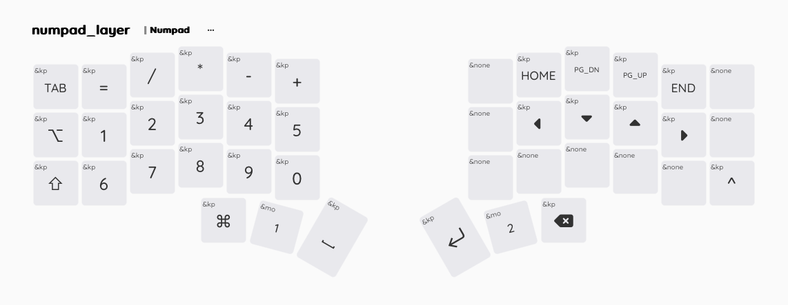
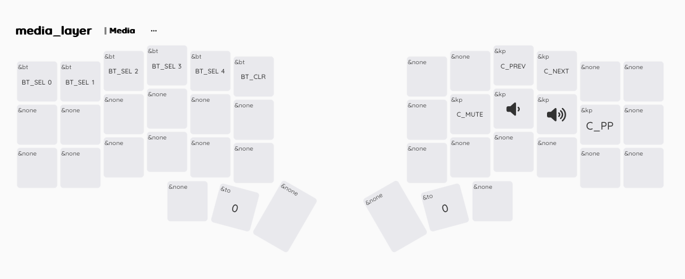
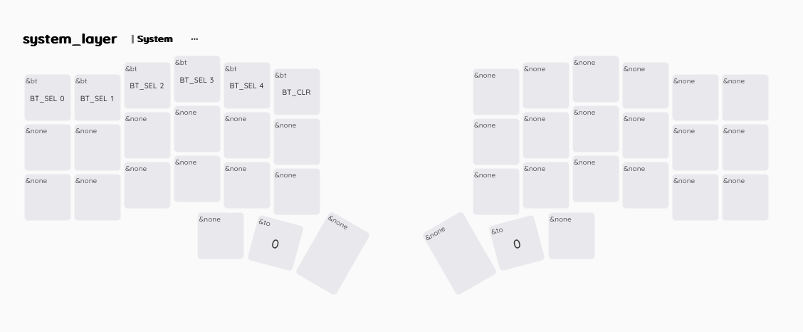

# Corne Slim

## Used components
- Corne Chocolate v2 (https://github.com/foostan/crkbd/blob/main/docs/corne-chocolate/v2/buildguide_en.md)
- 2 Power switches
- 2 Batteries 1100 mAh
- 42 Fast SMD diodes
- 42 Kailh Choc v1 Burnt Orange switches https://www.aliexpress.com/item/1005005883472162.html
- 40 Kalih Choc 1u keycaps https://a.aliexpress.com/_EQXTZk4
- 2 Kalih Choc 1.5u keycaps https://a.aliexpress.com/_EINeDHm
- 2 NRF52840 (Nice!Nano v2 analog) https://www.aliexpress.com/item/1005006446457448.html
- 2 OLED screens https://aliexpress.com/item/1005006976645322.html

## Case
- [3D printed case](/case/)

## Keymap

### Base layer

### Symbols layer

### Numpad layer

### Media layer

### System layer

### Combos

